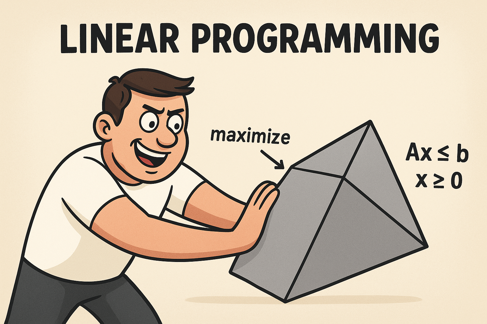

# Evaluation of HiGHS

## Evaluation results for various versions of HiGHS

1. Results for **HiGHS version 1.12.0** are listed in [here](./evaluation/v1.12.0/README.md).

## HiGHS

1. **HiGHS** is software for the definition, modification and solution of large scale sparse linear optimization models.

2. **HiGHS** is freely available from GitHub under the MIT licence and has no third-party dependencies.

3. **HiGHS** can solve [linear programming (LP)](https://en.wikipedia.org/wiki/Linear_programming) models as well as [mixed integer linear programming (MILP)](https://en.wikipedia.org/wiki/Linear_programming#Integer_unknowns) of the form:

$$
\begin{aligned}
\min                \quad &amp; c^T  x        \\
\textrm{subject to} \quad &amp; L \le Ax \le U  \\
                          &amp; l \le x \le u,
\end{aligned}
$$

5. [Documentation](https://lp-solve.github.io/) for **HiGHS**.

6. [Source code](https://github.com/kerrickstaley/lp_solve) for **HiGHS** on GitHub.


## MIPLIB

1. The **HiGHS** was evaluated using problems from the [**MIPLIB database**](https://miplib.zib.de/).

2. The current maintainers of the **MIPLIB** website and its content are Ambros Gleixner and Mark Turner. 

3. Citation for the **MIPLIB** database:

```bibtex
@article{
  author  = {Gleixner, Ambros and 
             Hendel, Gregor and 
             Gamrath, Gerald and 
             Achterberg, Tobias and 
             Bastubbe, Michael and 
             Berthold, Timo and 
             Christophel, Philipp M. and 
             Jarck, Kati and 
             Koch, Thorsten and 
             Linderoth, Jeff and 
             L\"ubbecke, Marco and 
             Mittelmann, Hans D. and 
             Ozyurt, Derya and 
             Ralphs, Ted K. and 
             Salvagnin, Domenico and 
             Shinano, Yuji},
  title   = {{MIPLIB 2017: Data-Driven Compilation of the 6th Mixed-Integer Programming Library}},
  journal = {Mathematical Programming Computation},
  year    = {2021},
  doi     = {10.1007/s12532-020-00194-3},
  url     = {https://doi.org/10.1007/s12532-020-00194-3}
}
```

4. The Abstract of the article "[MIPLIB 2017: Data-Driven Compilation of the 6th Mixed-Integer Programming Library](https://doi.org/10.1007/s12532-020-00194-3)":

> We report on the selection process leading to the sixth version of the Mixed Integer Programming Library, MIPLIB 2017. Selected from an initial pool of 5721 instances, the new MIPLIB 2017 collection consists of 1065 instances. A subset of 240 instances was specially selected for benchmarking solver performance. For the first time, these sets were compiled using a data-driven selection process supported by the solution of a sequence of mixed integer optimization problems, which encode requirements on diversity and balancedness with respect to instance features and performance data. 


## Image generated by ChatGPT



